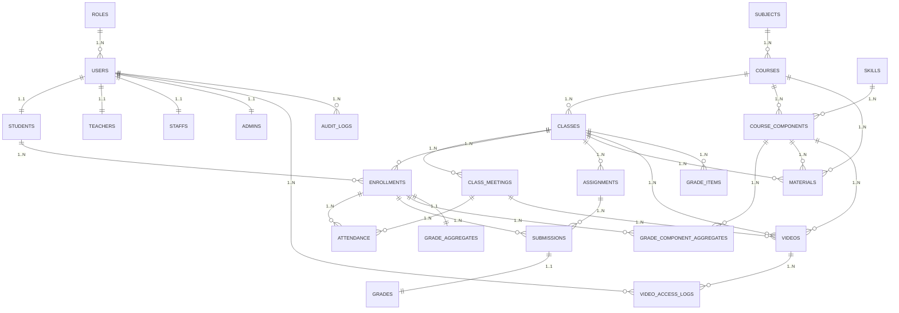

# Education Database Documentation

## 1. Tổng quan kiến trúc

Hệ thống cơ sở dữ liệu phục vụ **trung tâm giáo dục**, hỗ trợ toàn bộ quy trình từ quản lý tài khoản đến vận hành, bao gồm:

- **Quản lý người dùng & phân quyền**: mỗi user chỉ có **1 role** (admin, teacher, ta, student, staff) với hồ sơ mở rộng 1–1 (`students`, `teachers`, `staffs`, `admins`).
- **Quản lý học vụ**: môn học, khóa học, lớp học, lịch học, ghi danh, điểm danh.
- **Thành phần khóa học**: cho phép chia khóa học thành nhiều phần (component) gắn với kỹ năng hoặc nội dung để quản lý học liệu, bài tập, điểm theo từng phần (dùng cho mọi môn, không chỉ IELTS).
- **Học liệu & video**: tài liệu, video gắn với lớp hoặc component; có thể theo dõi lịch sử truy cập video.
- **Bài tập & chấm điểm**: giao bài, nộp bài, chấm điểm, tính điểm tổng và điểm theo thành phần.
- **Vận hành**: nhật ký hoạt động, cấu hình hệ thống.

**Nhóm bảng chính:**

1. **RBAC (Role-Based Access Control)** – `roles`, `users`, `students`, `teachers`, `staffs`, `admins`
2. **Academics** – `subjects`, `courses`, `classes`, `class_meetings`, `enrollments`, `attendance`
3. **Course Components** – `skills`, `course_components`, `grade_component_aggregates`
4. **Learning Assets** – `materials`, `videos`, `video_access_logs`
5. **Assignments & Grades** – `assignments`, `submissions`, `grades`, `grade_items`, `grade_aggregates`
6. **Ops** – `audit_logs`, `site_settings`

---

## 🔎 ERD

---

## 2. Nguyên tắc thiết kế & ràng buộc chính

### 2.1 Nguyên tắc

- **Mỗi user chỉ có 1 role** (`users.role_id`), không có bảng `user_roles`.
- Hồ sơ mở rộng 1–1 cho từng loại người: `students`, `teachers`, `staffs`, `admins`.
- **Teacher/TA ↔ class**: lưu trực tiếp trong `classes.teacher_id` & `classes.ta_id`.
- **Thành phần khóa học** (`course_components`) tổng quát, dùng được cho mọi môn học.
- **Chỉ role hợp lệ mới được truy cập** chức năng tương ứng (app kiểm soát, có thể dùng `roles.capabilities_json`).

### 2.2 Ràng buộc chính

- `users.email` **unique**
- `students.user_id`, `teachers.user_id`, `staffs.user_id`, `admins.user_id` **unique**
- `courses.code`, `classes.code` **unique**
- `enrollments(class_id, student_id)` **unique**
- `submissions(assignment_id, enrollment_id)` **unique**
- `grades.submission_id` **unique**
- `grade_component_aggregates(enrollment_id, course_component_id)` **unique**

---

## 3. Chi tiết bảng & quan hệ

### 3.1 RBAC & Profiles

#### `roles`

- Lưu role hệ thống (`admin`, `teacher`, `ta`, `student`, `staff`).
- Cột:
  - `code` — mã role (unique)
  - `capabilities_json` — quyền chi tiết (optional)

#### `users`

- Tài khoản đăng nhập chung, 1 role duy nhất.
- FK `role_id` → `roles.id`.

#### `students`, `teachers`, `staffs`, `admins`

- Hồ sơ mở rộng 1–1 với `users`.
- Chứa thông tin đặc thù (vd: chuyên môn của teacher, phòng ban của staff, quyền hạn đặc biệt của admin).

---

### 3.2 Academics

#### `subjects`

- Nhóm môn học/cấp học (IELTS, Toán 8…).
- `slug` — URL-friendly name.

#### `courses`

- Khóa học mẫu thuộc 1 môn.
- `code` — mã khóa (unique).

#### `classes`

- Lớp học thực tế của 1 course.
- FK `teacher_id` → `users.id` (role=teacher)
- FK `ta_id` → `users.id` (role=ta)

#### `class_meetings`

- Buổi học cụ thể của lớp.

#### `enrollments`

- Ghi danh học sinh vào lớp.
- Unique `(class_id, student_id)`.

#### `attendance`

- Điểm danh từng buổi học.

---

### 3.3 Course Components (áp dụng cho mọi môn)

- **skills**: Từ điển nhãn thành phần (kỹ năng, miền nội dung, chương…).
- **course_components**: Các phần của 1 course, gắn với `skill_id`, có `weight_percent`.

**Ví dụ:**
| Course | Component | Skill Code | Weight |
| -------------- | ------------ | ----------- | ------ |
| IELTS Advanced | Reading | READING | 25% |
| IELTS Advanced | Listening | LISTENING | 25% |
| Toán 8 | Đại số 8 | ALGEBRA_8 | 60% |
| Toán 8 | Hình học 8 | GEOMETRY_8 | 40% |
| Lý 8 | Cơ học | MECHANICS_8 | 30% |

---

### 3.4 Learning Assets

#### `materials`

- Tài liệu (pdf, doc, link…).
- Có thể gắn với course/class/component.

#### `videos`

- Video bài giảng hoặc ghi hình buổi học.
- Không có cờ downloadable (quản lý tải qua app/CDN).

#### `video_access_logs`

- Nhật ký xem video (tùy chọn).

---

### 3.5 Assignments & Grades

#### `assignments`

- Bài tập/bài kiểm tra.
- Có thể gắn với `course_component_id`.

#### `submissions`

- Bài nộp của học sinh.
- Unique `(assignment_id, enrollment_id)`.

#### `grades`

- Điểm & phản hồi cho bài nộp.

#### `grade_items`

- Cột điểm cấu hình cho lớp (tùy chọn). Dùng để đặt tên cột điểm, gắn trọng số và (nếu muốn) liên kết với thành phần khóa học.
- Không lưu điểm từng học sinh; điểm đến từ `assignments` → `submissions` → `grades` và được tổng hợp theo quy tắc lớp.
- Ảnh hưởng tính toán: dùng để tổng hợp điểm cuối kỳ (`grade_aggregates`) và theo thành phần (`grade_component_aggregates`).
- Trường tối thiểu gợi ý: `class_id`, `name`, `weight_percent`, `course_component_id?`, `order_index`.
- Mở rộng (nếu cần): map `assignments.grade_item_id` hoặc thêm bảng nhập tay cho cột không có bài nộp.

#### `grade_aggregates`

- Điểm tổng của học sinh trong lớp.

#### `grade_component_aggregates`

- Điểm tổng theo thành phần của khóa học.

---

### 3.6 Ops

#### `audit_logs`

- Nhật ký thao tác (ai, làm gì, khi nào).

#### `site_settings`

- Key–value cấu hình hệ thống.

---

## 4. Quy tắc phân quyền

| Role    | Chức năng chính                                    |
| ------- | -------------------------------------------------- |
| admin   | Toàn quyền quản lý hệ thống                        |
| teacher | Quản lý lớp dạy, tạo assignments/videos, chấm điểm |
| ta      | Hỗ trợ GV trong lớp, chấm điểm nếu được cấp quyền  |
| student | Xem học liệu, nộp bài, xem điểm cá nhân            |
| staff   | Hỗ trợ vận hành: enrollment, attendance…           |

---

## 5. Luồng dữ liệu tóm tắt

1. Tạo `users` với `role_id`, tạo profile mở rộng nếu cần (`students`/`teachers`/`staffs`/`admins`)
2. Tạo `subjects` → `courses` → `classes` → `class_meetings`
3. Tạo `skills` → `course_components`
4. Ghi danh học sinh (`enrollments`)
5. Thêm tài liệu (`materials`) và video (`videos`)
6. Tạo bài tập (`assignments`) → học sinh nộp (`submissions`) → chấm điểm (`grades`)
7. Tổng hợp điểm (`grade_aggregates`, `grade_component_aggregates`)
8. Theo dõi qua `attendance`, `video_access_logs`, `audit_logs`
