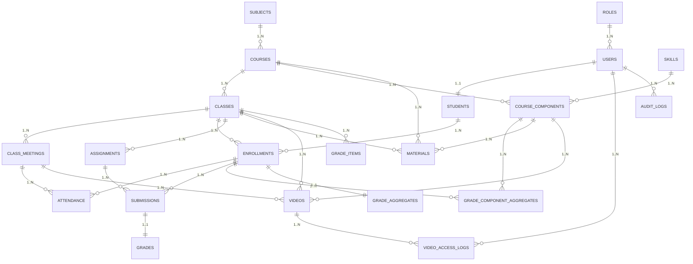

# Education Database Documentation

## 1. Tổng quan kiến trúc

Hệ thống DB phục vụ **trung tâm giáo dục** với quy trình:

- **Quản lý người dùng** (mỗi user đúng 1 role: admin, teacher, ta, student, staff).
- **Quản lý học vụ**: môn học, khóa học, lớp học, lịch học, ghi danh, điểm danh.
- **Học liệu & video**: tài liệu, video gắn với lớp/kỹ năng.
- **Bài tập & chấm điểm**: giao bài, nộp bài, chấm điểm, tính tổng điểm.
- **Hỗ trợ IELTS**: kỹ năng (Reading, Listening, Writing, Speaking) và thành phần khóa học.
- **Vận hành**: nhật ký hoạt động, cấu hình hệ thống.

**Nhóm bảng chính:**

1. RBAC (Role-Based Access Control) – `roles`, `users`, `students`.
2. Academics – `subjects`, `courses`, `classes`, `class_meetings`, `enrollments`, `attendance`.
3. Course Components – `skills`, `course_components`, `grade_component_aggregates`.
4. Learning Assets – `materials`, `videos`, `video_access_logs`.
5. Assignments & Grades – `assignments`, `submissions`, `grades`, `grade_items`, `grade_aggregates`.
6. Ops – `audit_logs`, `site_settings`.

---

## 🔎 ERD

---

## 2. Nguyên tắc thiết kế & ràng buộc chính

### 2.1 Nguyên tắc

- **Mỗi user chỉ có 1 role** (`users.role_id`), không có bảng `user_roles`.
- **Học sinh ↔ user**: quan hệ **1–1** (`students.user_id` unique).
- **Teacher/TA ↔ class**: lưu trực tiếp trong `classes.teacher_id` & `classes.ta_id`.
- **Hỗ trợ IELTS** qua `skills` & `course_components`, cho phép gắn tài nguyên/bài tập/điểm theo kỹ năng.
- **Chỉ role hợp lệ mới được truy cập** chức năng tương ứng (app kiểm soát, có thể dùng `roles.capabilities_json`).

### 2.2 Ràng buộc chính

- `users.email` **unique**.
- `students.user_id` **unique**.
- `courses.code`, `classes.code` **unique**.
- `enrollments(class_id, student_id)` **unique**.
- `submissions(assignment_id, enrollment_id)` **unique**.
- `grades.submission_id` **unique**.
- `grade_component_aggregates(enrollment_id, course_component_id)` **unique**.

---

## 3. Chi tiết bảng & quan hệ

### 3.1 RBAC

#### `roles`

- **Mục đích**: Lưu role hệ thống (admin, teacher, ta, student, staff).
- **Cột quan trọng**:
  - `code`: mã role (unique).
  - `capabilities_json`: JSON mô tả quyền (optional).

#### `users`

- **Mục đích**: Tài khoản đăng nhập chung.
- **Quan hệ**:
  - FK `role_id` → `roles.id`.
- **Lưu ý**: Role quyết định quyền truy cập.

#### `students`

- **Mục đích**: Hồ sơ mở rộng cho học sinh.
- **Quan hệ**:
  - 1–1 `users` qua `user_id` (unique).

---

### 3.2 Academics

#### `subjects`

- **Mục đích**: Nhóm môn học (IELTS, THPTQG…).
- **slug**: URL-friendly name.

#### `courses`

- **Mục đích**: Khóa học mẫu thuộc một môn (`subject_id`).
- **code**: mã khóa (unique).

#### `classes`

- **Mục đích**: Lớp học thực tế của một khóa.
- **Quan hệ**:
  - FK `teacher_id` → `users.id` (role=teacher).
  - FK `ta_id` → `users.id` (role=ta).

#### `class_meetings`

- **Mục đích**: Buổi học cụ thể trong lớp.

#### `enrollments`

- **Mục đích**: Ghi danh học sinh vào lớp.
- **Unique**: `(class_id, student_id)`.

#### `attendance`

- **Mục đích**: Điểm danh từng buổi.
- **Unique**: `(meeting_id, enrollment_id)`.

---

### 3.3 Course Components (phân nhỏ khóa học)

Hệ thống cho phép chia mỗi **course** thành nhiều **component** (thành phần) để quản lý học liệu, bài tập và điểm theo từng phần.

- **skills**: Từ điển các loại thành phần.
  - Có thể là **kỹ năng** (Reading, Listening, Writing, Speaking cho IELTS),  
    **miền nội dung** (Đại số, Hình học cho Toán), hoặc **chương** (Chương 1 – Cơ học, Chương 2 – Nhiệt học cho Vật lý).
- **course_components**: Các thành phần cụ thể thuộc một course, gắn với một skill.
  - Có thể đặt `weight_percent` nếu muốn tính điểm tổng theo trọng số từng phần.
  - Dùng cho bất kỳ môn học nào, không giới hạn ở IELTS.

**Ví dụ:**
| Course | Component Name | Skill Code | Weight |
|----------------|---------------|--------------|--------|
| IELTS Advanced | Reading | READING | 25% |
| IELTS Advanced | Listening | LISTENING | 25% |
| IELTS Advanced | Writing | WRITING | 25% |
| IELTS Advanced | Speaking | SPEAKING | 25% |
| Toán 8 | Đại số 8 | ALGEBRA_8 | 60% |
| Toán 8 | Hình học 8 | GEOMETRY_8 | 40% |
| Lý 8 | Cơ học | MECHANICS_8 | 30% |
| Lý 8 | Nhiệt học | THERMAL_8 | 30% |
| Lý 8 | Điện học | ELECTRIC_8 | 40% |

**Lợi ích:**

- Quản lý tài liệu, video, bài tập theo từng phần của khóa học.
- Tính điểm và báo cáo kết quả học tập theo từng thành phần.
- Dùng chung cơ chế cho cả môn IELTS, Toán, Lý, Hóa, v.v.

---

### 3.4 Learning Assets

#### `materials`

- **Mục đích**: Tài liệu (pdf, doc, link…).
- **can_download**: quyền tải.
- **tags**: phân loại nhanh.

#### `videos`

- **Mục đích**: Video bài giảng/ghi hình buổi học.
- **Không có** cờ downloadable (quyền tải do app/CDN kiểm soát).

#### `video_access_logs`

- **Mục đích**: Lịch sử xem video (optional).

---

### 3.5 Assignments & Grades

#### `assignments`

- **Mục đích**: Bài tập/bài kiểm tra.
- **course_component_id**: gắn kỹ năng nếu cần.

#### `submissions`

- **Mục đích**: Bài nộp của học sinh.
- **Unique**: `(assignment_id, enrollment_id)`.

#### `grades`

- **Mục đích**: Điểm & phản hồi cho bài nộp.
- **Unique**: `submission_id`.

#### `grade_items`

- **Mục đích**: Cấu hình điểm thành phần của lớp (optional).

#### `grade_aggregates`

- **Mục đích**: Điểm tổng kết lớp.

---

### 3.6 Ops

#### `audit_logs`

- **Mục đích**: Nhật ký thao tác (ai, làm gì, lúc nào).

#### `site_settings`

- **Mục đích**: Key–value cấu hình hệ thống.

---

## 4. Quy tắc phân quyền (Role Access)

| Role    | Chức năng chính                                          |
| ------- | -------------------------------------------------------- |
| admin   | Quản lý toàn bộ hệ thống, CRUD mọi bảng.                 |
| teacher | Quản lý lớp mình dạy, tạo assignments/videos, chấm điểm. |
| ta      | Hỗ trợ GV trong lớp, chấm điểm nếu được cấp quyền.       |
| student | Xem học liệu, nộp bài, xem điểm của mình.                |
| staff   | Hỗ trợ vận hành (enrollment, attendance…).               |

> App nên đọc `roles.capabilities_json` để map quyền thay vì hardcode hoàn toàn, giúp linh hoạt mở rộng.

---
